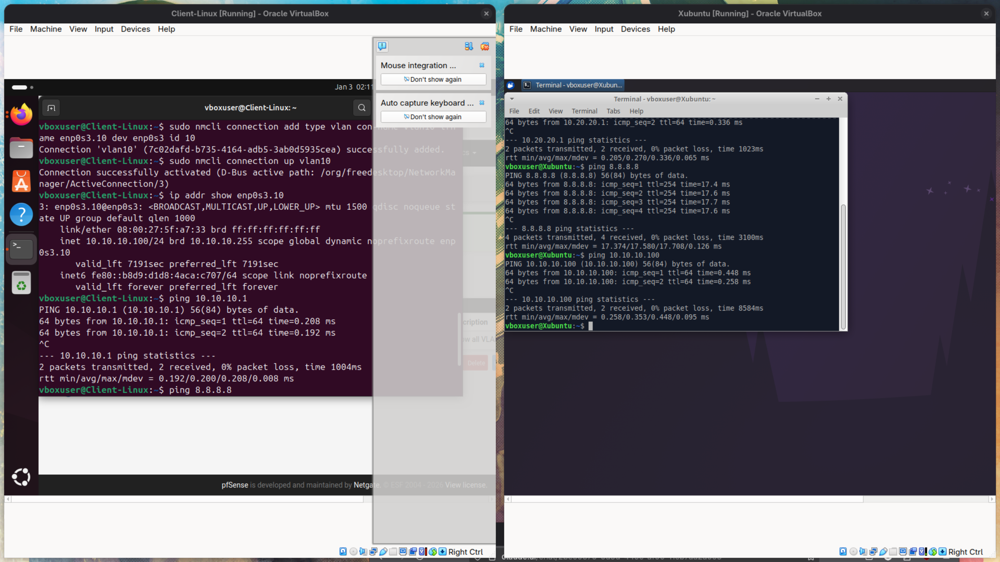

# pfSense Multi-VLAN Network Lab

## Overview
Built a virtualized network environment with segmented VLANs to demonstrate enterprise network architecture and security principles.

## What I Built

```
            Internet (NAT)
                 |
            [pfSense Firewall]
                 |
         ┌───────┴───────┐
      VLAN 10          VLAN 20
   (10.10.10.0/24)  (10.20.20.0/24)
         |               |
    Ubuntu VM        Xubuntu VM
```

## Technical Implementation

**Network Segmentation:**
- Created two isolated VLANs (VLAN 10 and VLAN 20) using IEEE 802.1Q tagging
- Configured pfSense as the central router/firewall managing all traffic
- Each VLAN has its own subnet and DHCP server

**Key Components:**
- **Hypervisor:** VirtualBox
- **Firewall:** pfSense 
- **VLANs:** 
  - VLAN 10 (10.10.10.0/24) 
  - VLAN 20 (10.20.20.0/24) 
- **Clients:** Ubuntu and Xubuntu VMs with VLAN tagging configured

**What It Does:**
- Traffic isolation between VLANs
- Inter-VLAN routing controlled by firewall rules
- Both VLANs have internet access through NAT
- Demonstrates network segmentation security practices



*Successful ping between VLAN 10 (10.10.10.100) and VLAN 20 (10.20.20.100)*

## Skills Demonstrated

- VLAN configuration and 802.1Q tagging
- Network segmentation architecture
- Firewall configuration and policy management
- Inter-VLAN routing
- Subnet planning and IP addressing
- Linux network interface configuration
- Virtualization and lab environment setup


---

**Technologies:** pfSense, VirtualBox, VLANs, Linux, Networking
